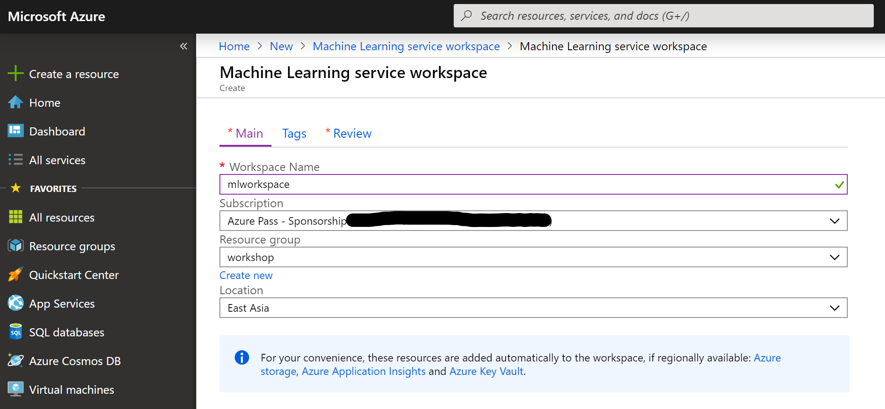

- **No back and forth**
- **Scripting**
- **Use cloud shell**
- **No az copy**

# Genomics on Azure | Hong-Kong | September 2019

## Introduction

In this workshop you will explore how to use [Microsoft Azure](https://azure.microsoft.com/en-us/) for Genomics/Bioinformatics. The scenario is as follows: you have received Illumina sequenced samples for a case/control study and want to predict which variants are likely causal for the disease. For variant calling we will use [Microsoft Genomics](https://azure.microsoft.com/en-us/services/genomics/) and for the prediction of causal variants we will use [Azure AutoML](https://docs.microsoft.com/en-us/azure/machine-learning/service/concept-automated-ml). To pack this entire scenario into the short time frame of a workshop, we will take some shortcuts. For one, we will only call variants for one chromosome and one sample. After that, you will be provided with a CSV file that contains gender, disease status and variant calls (only few hundred sites) for a few hundred indivduals. While obviously artificial, this workshop will expose you to a number of tools and touch on a number of concepts and services, that you can use in your daily work.

## Prerequisites

You will need:

- A computer/laptop/tablet with internet connection
- An Azure Pass (or an Azure account with an active subscription)
- Basic familiarity with a terminal/shell

The process of setting up an Azure Pass, which gives you free credits on Azure is [described below](#account-setup).

## Duration

The workshop should take roughly two hours. If get stuck during the [variant calling part](#variant-calling), feel free to skip ahead to the [AutoML part](#FIXME).

## Overview of steps

The overall flow is as follows:

- Set up your Azure account
- Create a resource group
- Spin up a Data Science VM
- Create an Azure Storage and an MS Genomics account
- Copy FastQ files into the storage account
- Submit an MS Genomics job for variant calling
- Download the VCF file
- Set up an Azure Machine Learning workspace
- Use AutoML with a preprocessed CSV file containing variants to predict causal factors
- Delete all resources

Some steps, like setting up of (sub-)accounts for storage etc, are a bit mechanical, but required since you start from a fresh account.

## Concepts

We will touch on the following subjects:

- Azure Account
- Azure Portal
- Resource groups
- Storage accounts
- Blob storage
- Data Science VM
- MS Genomics
- Azure AutoML
- Jupyter Notebooks

## Set up Your Azure Account / Activate Your Azure Pass

In this step you will activate an Azure Pass, which allows you to try out Azure for free. This is a two-step process where you first create a Microsoft account (if you don't already have one) and then activate the Azure Pass subscription for that account.

1. Open an Incognito/Private window in your browser (to avoid interference with existing sessions) and follow the  [step-by-step guide](https://www.microsoftazurepass.com/Home/HowTo?Length=5). Try using your organisational email account first. If that doesn’t work, please
create a new Microsoft Account at https://account.microsoft.com/account. You can use
any email address for the sign-up process.
1. After successfully completing the Azure Pass redemption process, you will receive two
confirmation emails. One will list the amount available with the Azure Pass and its expiration date. The other will contain the subscription ID and name associated with the Azure Pass

After receiving those emails, log into the [Azure portal](https://ms.portal.azure.com/#home) and have a look around.

**Note**: Users with an existing Azure account, need to make sure they use the Azure pass subscription for subsequenent work. Log into the [Azure portal](https://ms.portal.azure.com/#home), click on your profile at the top right and "Switch directory" to your
Azure Pass subscription.

You can keep track of the balance in your Azure Pass by either visiting https://www.microsoftazuresponsorships.com/Balance or go to "Cost Management + Billing" in the Azure Portal.

### Info: Azure Portal

The [Azure portal](https://ms.portal.azure.com/#home) is web-based and intuitive console for all resources on Azure. You can build, manage, and monitor everything from simple web apps to complex cloud deployments. Have a quick look at [this introduction to the elements of the portal](https://docs.microsoft.com/en-us/azure/azure-portal/azure-portal-overview#getting-around-the-portal) or jump straight in and start using it. The sidebar and header are always present. Everything else in the portal is organized in "blades" that open and keep opening to the right (think: swipe motion).

An aside: everything you do on the Portal can also be scripted.

## Create a resource group

[Resource groups](https://docs.microsoft.com/en-us/azure/azure-resource-manager/resource-group-overview#resource-groups) are a like namespaces that holds related resources. This could for example be storage and compute resources for a particular research project. Think of it as a virtual asset tag. Whenever you create anything on Azure you have to assign it to a resource group. This ensures that you can later easily analyze costs for a project and you easily delete all resources belonging to a project. No manual tagging is needed and you will never see any orphaned resources (when talking to other cloud providers make sure to ask how that's implemented on their platform :wink:).

To create a resource group:

- Log into the [Azure Portal](http://portal.azure.com/)
- Click on "Create a resource"
- Search for "Resource group" and click on the search result
- Click on "Create"

Next enter the required details:

- Select your Subscription ("Azure Pass...")
- Enter a name for the resource group, e.g. "workshop". Please remember this name as you will use it throughout this workshop.

- As region select "(Asia Pacific) East Asia", which refers to our HongKong datacenters
- Click on "Review + Create". This will trigger a quick validation of your input
- Click on "Create"

- After a short while, a notification will appear on the top right saying "Resource group created". Click on the notification item (a bell) and "Go to resource group". Alternatively just search for "Subscriptions" in the search bar at the top
- You will see a subscription ID. Please note this ID down. We will need it later. Think of a subscription as the equivalent of a credit card, or cost center to which costs are charged.

## Spinning up a Data Science Virtual Machine

Virtual machines are "servers" in the cloud (only that they are virtualized for efficient resource usage). You can install any operating system you like on these machines. One great default choice for scientists is the so-called Data Science VM (DSVM). This is an Azure Virtual Machine image, which comes pre-configured and pre-installed with many tools commonly used for data analytics, machine learning and AI training. The image comes in different operating systems (Ubuntu, CentOS, Windows) and flavours (e.g. GeoAI, Deep Learning VM). The [list of included tools](https://docs.microsoft.com/en-us/azure/machine-learning/data-science-virtual-machine/overview#whats-included-on-the-dsvm) is long and includes R Studio, Jupyter, Conda, Julia, TensorFlow, Cafe, Pytorch and several Azure tools. The alternative is to start with a plain Linux image and install required tools manually.

To start your own DSVM:

- Click on "Create a resource"
- Search for "Data Science"
- Choose "Data Science Virtual Machine for Linux (Ubuntu)"
- Click on Create

An alternative way to get here is to:

- Starting from the Azure Portal home page, go to "Virtual Machines"
- Click on "Add"
- In the "Image" field, click on "Browse all public and private images"
- Search for "Data Science"
- Choose "Data Science Virtual Machine for Linux (Ubuntu)"

Now that you are in the "Create a virtual machine" blade:

- Select your Subscription ("Azure Pass...")
- Select the previously created resource group
- Give your virtual machine a name, e.g. "MyDSVM"
- As regiom, select "(Asia Pacific) East Asia"
- Skip all following options until "Administrator account"
- Select "Password" instead of "SSH public key"
- Enter a username (Note: you cannot use standard names like "admin")
- Enter a strong password
- Confirm the password
- Click on "Review + create"
- Once your entries are validated, click "Create".
  

The deployment of your VM (which includes several resources like disks, IP etc.) will take a minute or so. Once done, it will display "Your deployment is complete". You now have your own server running in the cloud, armed with plenty of data science tools.

To log into your VM click on "Go to resource" or click "Virtual machines" on the Portal home page and select your VM. In the virtual machine tab, you can see monitor logs and a lot of settings. For this workshop we only need the servers' IP address, which is in the "Overview" tab on the right.

 You can also get to it by clicking on "Connect", which pops up a little blade to the right.

Now open a terminal (any terminal for Linux and Mac Users, WSL for Windows users or use the Cloud shell in the Azure portal, located on the top right) or a dedicated SSH app (like [Putty](https://www.chiark.greenend.org.uk/~sgtatham/putty/latest.html)) and ssh into the machine, by using your user name and the IP address:

    ssh user@ip

## Variant Calling with MS Genomics

[MS Genomics](https://azure.microsoft.com/en-us/services/genomics/) is an accelerated cloud service that allows you to run BWA and the GATK best practices pipeline easily, securly and at scale. It starts from FastQ and outputs VCF or gVCF. Input files have to be stored on Blob storage and output files are written to Blob. The service is configured through commandline arguments or a configuration file. Here, we'll use commandline arguments.

To get started we need

1. a storage account for input and output files
1. an MS Genomics account
1. the MS Genomics client

The above steps are all scripted up to save some time during the workshop. After running this script, you will upload some example FastQ files and run MS Genomics.

### Creating an MS Genomics account, a storage account and installing the MS Genomics client

You need to create a storage account, so that the Genomics service has somewhere to read from and write to. Storage accounts are very versatile. In most cases you will use them for (Windows) file shares or Blob storage but there are more options. Blob (binary large object) storage is Azure's implementation of a general purpose object storage. Think of it as performant and robust, large scale online storage. You can use it for archive, data staging, temporary storage, sharing etc. It is not however an attached disk, i.e. you cannot mount it or access it like a file share. Think of it as a form of FTP server. For more information see [this introduction to Blob storage](https://docs.microsoft.com/en-us/azure/storage/blobs/storage-blobs-introduction). A great cross platform GUI for blob storage managment is the [Storage Explorer](https://azure.microsoft.com/en-us/features/storage-explorer/). A very performant way to interact with Blob storage is to use the CLI based `azcopy` (see below).

To authenticate against MS Genomics you need a separate MS Genomics account. Accounts can be shared and can help to separate costs. Account authentication is done through keys, which we will use below.

To submit jobs to MS Genomics you need to install its Python client, which is done here with conda and pip. [Conda](https://docs.conda.io/en/latest/) is a widely used package manager that allows you to install all sorts of packages as normal user. This includes hundreds of Bioinformatics packages. For more info have a look at [Bioconda](https://bioconda.github.io/user/install.html#set-up-channels). Here we use conda to create a separate Python environment to install software to.

Again, to save some time, the installation is again part of the deployment script used below.

### Copying of input data

In this step you will copy some FastQ files to the "input" container of the blob storage account. We will use the commandline tool `azcopy` for this, which is already installed on your DSVM. Note that `azcopy` was recently rewritten entirely, so the online documentation will be for a newer version.

Run the following command to coypy chr21 samples FastQ into your blob storage account:

    strgkey=...# put your storage key here 
    strgurl=...# put your storage url (without trailing slashes) here.
    azcopy --source https://msgensampledata.blob.core.windows.net/small/chr21_1.fq.gz \
      --destination $strgurl/input/chr21_1.fq.gz --dest-key $strgkey
    azcopy --source https://msgensampledata.blob.core.windows.net/small/chr21_2.fq.gz \
      --destination $strgurl/input/chr21_2.fq.gz --dest-key $strgkey

Note, the backslashes are just for line continuation.

The transfer will roughly take a minute per file.

Go to your storage account in the portal, click on Blobs and verify that the files are there.

### Variant calling

[MS Genomics](https://azure.microsoft.com/en-in/services/genomics/) is an accelerated, HIPAA compliant and secure cloud implementation of BWA and the GATK best practices pipeline. It's roughly 7X faster than typical implementations and scales dynamically.  In short it does the heavy lifting of running a resource secondary analysis and resource hungry workflow for you, while you can focus on the science.

Now that you've uploaded FastQ files you are ready to submit a job to MS Genomics.

For simplicities sake, we will use a simple (but long) command line for job submission. Alternatively, you can use a config file instead.

    msgenurl=...# put your MS Genomics endpoint here
    msgenkey=...# put your MS Genomics key here 
    strgacc=...# put your storage account name here
    msgen submit -u $msgenurl -k $msgenkey \
      -pa R=hg38m1 -bz true -bqsr true -p gatk4 \
      -ia $strgacc -ik $strgkey -ic input \
      -oa $strgacc -ok $strgkey -oc output \
      -b1 chr21_1.fq.gz -b2 chr21_2.fq.gz 

Here, we specificy to use hg38, use BQSR, GATK4 and bgzip compression. We could have specified multiple FastQ files and requests a gVCF file instead of VCF.

If you get the error message "msgen: invalid option -- 'u'", then you forgot to activate the conda environment (see above).
 
On successful submission, the command will return a process id.
The job will take a few minutes to run. You can monitor its status with:

    msgen list -u $msgenurl -k $msgenkey

Once completed, go the storage account in your portal, click on "Blobs" and check which output files were created. To download and inspect the created vcf file, log into your DSVM and run:

    az storage blob copy $strgurl/output/chr21_1.fq.gz.${wfid}.vcf.gz .

where `${wfid}` is the workflow id returned by `msgen list`

Note, that we won't actually use this file later. Instead, we will assume you generated VCF files for hundreds of case/control samples already and proceed from there.

## Predicting disease causing factors with Azure AutoML

Azure Machine Learning offers web interfaces & SDKs, which allow you to quickly train and deploy your machine learning models and pipelines at scale. It supports a variety of open-source Python frameworks, such as PyTorch, TensorFlow, and scikit-learn. A very special product is ML studio, an interactive web-service that allows you to use machine learning capabilities without writing a single line of code. To make things more interesting here, we will use the Python APIs from an Azure ML Jupyter notebook.

The goal is to take cleaned input data containing variant calls and some metainformation for a case/control study and use machine learning to predict causal factors. Setting up a machine learning pipeline can be time-consuming and requires a lot of prior-knowledge. You need to make an informed algorithm choice and train and tune the model. [Azure Automated Machine Learning (AutoML)](https://docs.microsoft.com/en-us/azure/machine-learning/service/concept-automated-ml) is a very new service, coming straight out of Microsoft Research, that automates the time consuming, iterative tasks of machine learning model development. It is effectively an AI informed recommender system, that iterates over multiple algorithms and tunes parameters automatically. We will later use Explainers that allow you to interpret the model, thereby also pointing you at the most important features (causal factors). This makes the ML/AI models understandable. This AI transparency is one of [Microsoft's six AI guiding principles](https://www.microsoft.com/en-us/ai/our-approach-to-ai). When talking to other cloud providers, make sure to ask them about their principles :wink:.

### Create a Workspace and start an ML notebook

Workspaces help to group all ML resources together in one environment. Here, we will first create an environment and then start a Jupyter Notebook:

- Go to the [Azure Portal](http://portal.azure.com/)
- Select "+Create a resource"
- Use the search bar to find "Machine Learning service workspace".
- Select the Machine Learning service workspace and click "Create".
- Fill in the information required to configure the workspace. Make sure to use the same resource group you've used so far and "East Asia" as region.
- Click "Review and Create" to validate your entries and once that's done click "Create"
- Wait until the workspace is deployed. Then "Go to resource"

Now let's start a Jupyter notebook VM:

- In your ML workspace, locate the "Notebook VM" menu item
- Click on "+ New" to start a new VM
- Give it a name
- For size select "STANDARD\_D3" which has 4 vCPUs and 14GB of RAM (if "D3\_V2" is pre-selected, just keep that entry)

- Wait until the VM is up and running
- Click on "Jupyter" in the URI row

[Jupyter notebooks](https://jupyter.org/) are a wonderful way to perform data science in your browser. They support Julia, Python and R (hence the name) and can run on remote servers as in this case. Notebooks consist of cells that can either be text or code and you can execute the code cells, by selecting them and hitting "Shift-Enter" or clicking on "Run". Here, we will upload a Notebook that contains all the code necessary to run this part of the workshop.

- Download [this notebook](https://raw.githubusercontent.com/andreas-wilm/microsoft-roadshow-hongkong-09-2019/master/automl-on-variants.ipynb)  to your local computer
- In your Jupyter server, click on "Upload", select the just downloaded file and click "Upload" again
   Click on the ipynb file to open it
- Now walk through all cells, by selecting them one after the other and clickin "Run" or hitting "Shift-Enter", per cell
- Take note of the comments in the notebook and the generated output. Also note that the notebook depends on one interactive login, which requires your attention.

At the end, you should be able to answer what the most likely disease causing factors were.

If you ran out of time, have a look at this [completed Notebooks (as static pdf)](automl-on-variants-complete.pdf).

## Cleaning up

Because all resources used here were created under one resource group, you can easily delete them:

- Go to the [Azure Portal](http://portal.azure.com/)
- Click on "All resources" (or go directly to your Resource Group if it's shown)
- Go to "Resource Groups" and then your resource group
- Click on "Delete resource group"
- Confirm by typing in the name of your resource group and click on "Delete"

All attached resources will now be deleted and consequently won't be charged anymore.
